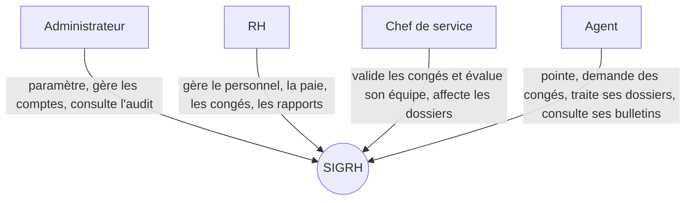
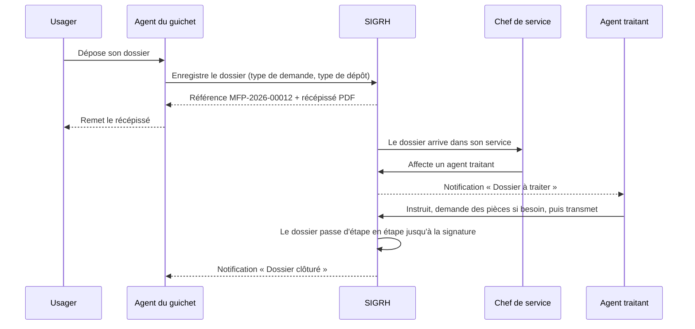

# 1. Présentation du projet SIGRH

**SIGRH** (Système Intégré de Gestion des Ressources Humaines) est une application web pour un **ministère de la Fonction publique**. Elle rassemble dans un seul outil la gestion du personnel du ministère (agents, présences, congés, paie, évaluations) et le suivi des **dossiers administratifs** déposés par les fonctionnaires (avancement, titularisation, retraite, mutation…).

On y accède depuis un navigateur, sur ordinateur ou sur téléphone. Chaque personne voit uniquement ce que son rôle lui permet de voir.

## 1.1 Le problème de départ

Dans beaucoup d'administrations, le travail RH et le traitement des dossiers se font encore sur papier, dans des tableurs Excel dispersés et par échanges de courrier entre services. Cela crée des problèmes concrets :

| Problème constaté | Conséquence |
| --- | --- |
| Registres de présence papier | Retards et absences difficiles à contrôler, aucune statistique |
| Congés demandés sur papier | Soldes calculés à la main, erreurs, congés accordés deux fois |
| Paie calculée dans Excel | Erreurs de calcul, bulletins longs à produire |
| Dossiers transmis physiquement de bureau en bureau | Dossiers perdus, personne ne sait où en est un dossier, délais non respectés |
| Aucune traçabilité | Impossible de savoir qui a fait quoi et quand |
| Informations dispersées | La direction n'a pas de vue d'ensemble pour décider |

## 1.2 Le but du projet

Offrir un **outil unique, fiable et traçable** qui :

1. **centralise** toutes les informations sur les agents dans une seule base de données ;
2. **automatise** les calculs répétitifs (heures travaillées, soldes de congés, salaires, impôt) ;
3. **suit chaque dossier** déposé au ministère, étape par étape, du guichet jusqu'à la signature ;
4. **informe** automatiquement les bonnes personnes (notifications) ;
5. **donne des indicateurs** à la direction (tableaux de bord et rapports).

## 1.3 Ce que le projet améliore dans l'administration

| Domaine | Avant | Avec SIGRH |
| --- | --- | --- |
| **Présences** | Cahier de signature | Pointage en un clic, avec position GPS sur mobile. Retards et heures supplémentaires calculés automatiquement, rapport mensuel exportable |
| **Congés** | Demande papier, réponse lente | Demande en ligne, validation par le chef de service ou les RH, solde mis à jour automatiquement, agent notifié |
| **Paie** | Calcul manuel | Calcul automatique pour tous les agents en un clic, bulletin PDF téléchargeable |
| **Dossiers** | Dossier physique qui circule | Numéro de référence, circuit de traitement défini, agent traitant désigné, historique complet, alerte en cas de retard, récépissé remis à l'usager |
| **Performance** | Notation rarement suivie | Évaluations, objectifs suivis en continu, score calculé automatiquement |
| **Pilotage** | Rapports faits à la main | Tableaux de bord en temps réel : effectifs, présences, masse salariale, dossiers en retard |
| **Transparence** | Aucune trace | Journal d'audit : chaque action sensible est enregistrée (qui, quoi, quand) |
| **Sécurité** | Fichiers partagés sans contrôle | Connexion obligatoire, droits par rôle, salaires visibles seulement par les RH |

**Gains attendus** : moins d'erreurs, des délais de traitement des dossiers plus courts et mesurés, moins de papier, une meilleure transparence envers les agents et les usagers, et des décisions appuyées sur des chiffres.

## 1.4 Qui utilise l'application ?

| Rôle | Exemple | Ce qu'il fait |
| --- | --- | --- |
| **Administrateur** | Secrétaire générale | Tout. En plus : gère les comptes et les rôles, supprime des employés, consulte le journal d'audit |
| **RH** | Directeur des RH | Gère les employés et les départements, valide les congés, génère la paie, publie les annonces, consulte les rapports, paramètre le circuit des dossiers |
| **Chef de service** | Directeur d'une direction | C'est un agent désigné *responsable* d'un département : il voit son équipe, valide ses congés, l'évalue et affecte les dossiers de son service |
| **Agent** | Gestionnaire, comptable… | Pointe, demande des congés, consulte ses bulletins et ses évaluations, traite les dossiers qui lui sont affectés |

## 1.5 Les modules

1. **Tableau de bord** : chiffres clés adaptés au rôle de chaque utilisateur.
2. **Employés** : fiche de chaque agent, recherche avancée, export.
3. **Départements** : directions, responsables, effectifs, budget.
4. **Présences** : pointage, historique, rapport mensuel, clôture de la journée.
5. **Congés** : demandes, validation, soldes.
6. **Paie** : calcul, bulletins PDF, paiement.
7. **Performance** : évaluations, objectifs, analyse automatique.
8. **Projets & dossiers** : enregistrement, circuit, agent traitant, pièces jointes, récépissé.
9. **Rapports** : départements, paie, congés, dossiers, analyses RH.
10. **Annonces & calendrier** : informations internes et agenda.
11. **Comptes & audit** : rôles et journal des actions.
12. **Mon espace** : coordonnées, mot de passe, analyse personnelle.

## 1.6 Exemple : le parcours d'un dossier

Un fonctionnaire vient déposer une demande d'avancement au guichet :

À tout moment, n'importe qui ayant accès au dossier voit **à quelle étape il se trouve**, **qui le traite** et **s'il est en retard** par rapport au délai prévu.

## 1.7 Technologies (en résumé)

- **Frontend** (ce que l'utilisateur voit) : React, affiché dans le navigateur.
- **Backend** (le serveur) : Node.js avec Express. Il reçoit les demandes, applique les règles et parle à la base de données.
- **Base de données** : PostgreSQL, qui stocke toutes les informations dans des tables.
- **Sécurité** : mots de passe chiffrés (bcrypt) et jeton de connexion (JWT).

Le détail des choix techniques se trouve dans le document 2 (cahier des charges), et le fonctionnement complet dans les documents 3 à 8.

## 1.8 Les 8 documents

| N° | Document | À lire pour… |
| --- | --- | --- |
| 1 | Présentation du projet | Comprendre le but et l'intérêt du projet |
| 2 | Cahier des charges | Connaître précisément les besoins et les règles |
| 3 | Guide de réalisation | Refaire le projet soi-même, phase par phase |
| 4 | Commandes et code expliqués | Comprendre chaque commande et chaque fichier de code |
| 5 | Base de données PostgreSQL | Installer, comprendre et utiliser la base |
| 6 | API REST | Connaître et tester toutes les adresses du serveur |
| 7 | Pourquoi chaque fichier | Savoir quels fichiers créer, comment les nommer et dans quel ordre |
| 8 | API REST avec Postman | Tester toutes les routes avec Postman, grâce à une collection prête à importer |

---
Projet SIGRH (EMS) — documentation.
