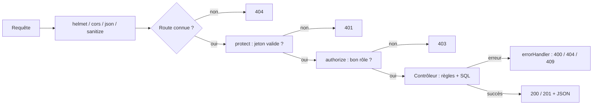

# 6. L'API REST — comment l'utiliser étape par étape

L'**API** est l'ensemble des adresses que le serveur met à disposition. Le site React ne touche jamais la base de données directement : il envoie des requêtes à l'API, qui vérifie les droits, applique les règles et répond en **JSON**.

## 6.1 Principe d'une requête

Une requête contient :

| Élément | Exemple | Rôle |
| --- | --- | --- |
| **Méthode** | `GET`, `POST`, `PUT`, `PATCH`, `DELETE` | Ce qu'on veut faire |
| **Adresse** | `http://localhost:5002/api/leaves` | Sur quoi |
| **Paramètres d'adresse** | `?status=pending&page=2` | Filtres |
| **En-têtes** | `Authorization: Bearer eyJhbGci...` et `Content-Type: application/json` | Qui je suis ; format du corps |
| **Corps** (pour POST, PUT, PATCH) | `{"leave_type":"paid","start_date":"2026-10-05","end_date":"2026-10-09"}` | Les données envoyées |

| Méthode | Sens | Exemple |
| --- | --- | --- |
| `GET` | Lire | `GET /api/employees` |
| `POST` | Créer, ou déclencher une action | `POST /api/leaves`, `POST /api/payroll/generate` |
| `PUT` | Modifier (fiche complète ou plusieurs champs) | `PUT /api/employees/5` |
| `PATCH` | Modifier une partie (un statut) | `PATCH /api/leaves/12/review` |
| `DELETE` | Supprimer | `DELETE /api/departments/3` |

**Le parcours d'une requête dans le serveur** :


## 6.2 Liste complète des routes

Légende des accès : **Public** = sans connexion ; **Connecté** = tout utilisateur connecté ; **RH** = rôles `hr` et `admin` ; **Admin** = rôle `admin` seulement ; **Chef** = chef de service du département concerné.

### Authentification — `/api/auth`
| Méthode | Adresse | Accès | Corps | Réponse |
| --- | --- | --- | --- | --- |
| POST | `/api/auth/register` | Public | `{ name, email, password, phone?, matricule? }` | 201 `{ token, user }` |
| POST | `/api/auth/login` | Public | `{ email, password }` | 200 `{ token, user }` |
| GET | `/api/auth/me` | Connecté | — | `{ user }` |
| PUT | `/api/auth/password` | Connecté | `{ currentPassword, newPassword }` | `{ message }` |

### Employés — `/api/employees`
| Méthode | Adresse | Accès | Détails |
| --- | --- | --- | --- |
| GET | `/api/employees` | Connecté (champs filtrés selon le rôle) | Paramètres : `q`, `department`, `status`, `designation`, `joinedFrom`, `joinedTo`, `minSalary`, `maxSalary` (RH), `sort` (`name`, `code`, `joining`, `salary`, `department`, `designation`), `order` (`asc`/`desc`), `page`, `limit`. Réponse : `{ data, total, page, limit }` |
| GET | `/api/employees/me` | Connecté | Ma fiche complète |
| PUT | `/api/employees/me` | Connecté | `{ phone, address }` |
| GET | `/api/employees/:id` | Connecté (champs filtrés) | Une fiche |
| POST | `/api/employees` | RH | `{ full_name, email, department_id, designation, grade, salary, date_of_joining, … , createAccount?, password?, role? }` |
| PUT | `/api/employees/:id` | RH | Champs à modifier (dont les soldes de congés) |
| DELETE | `/api/employees/:id` | Admin | Désactive le compte, puis supprime la fiche |

### Départements — `/api/departments`
| Méthode | Adresse | Accès | Corps |
| --- | --- | --- | --- |
| GET | `/api/departments` | Connecté | — (avec `employee_count` et `monthly_salary_cost`) |
| GET | `/api/departments/:id` | Connecté | — (avec `members`) |
| POST | `/api/departments` | RH | `{ name, code, description, budget, manager_id }` |
| PUT | `/api/departments/:id` | RH | Idem |
| DELETE | `/api/departments/:id` | Admin | — |

### Présences — `/api/attendance`
| Méthode | Adresse | Accès | Détails |
| --- | --- | --- | --- |
| POST | `/api/attendance/check-in` | Connecté | `{ latitude?, longitude?, note? }` → 201 ; déjà pointé → **409** |
| POST | `/api/attendance/check-out` | Connecté | → 200 avec `working_hours` et `overtime` |
| GET | `/api/attendance/today` | Connecté | Mon pointage du jour, ou `null` |
| GET | `/api/attendance` | Connecté | `from`, `to`, `status`, `employee`, `department`, `scope=team`. RH : tous ; chef : son équipe ; agent : lui-même |
| GET | `/api/attendance/report` | Connecté | `year`, `month`, `department` → rapport mensuel |
| POST | `/api/attendance` | RH | Saisie ou correction : `{ employee_id, work_date, check_in, check_out, status?, note? }` |
| POST | `/api/attendance/mark-absent` | RH | `{ date }` → `{ absent, onLeave }` et notifications |

### Congés — `/api/leaves`
| Méthode | Adresse | Accès | Détails |
| --- | --- | --- | --- |
| GET | `/api/leaves` | Connecté | `scope` (`mine`, `team`, `all`), `status`, `type`, `employee`, `department` |
| GET | `/api/leaves/balance` | Connecté | Mes soldes ; `?employee=` pour RH et chef |
| POST | `/api/leaves` | Connecté | `{ leave_type, start_date, end_date, reason }` |
| PATCH | `/api/leaves/:id/review` | RH ou Chef | `{ action: "approve" \| "reject", comment }` |
| PATCH | `/api/leaves/:id/cancel` | Demandeur ou RH | — |

### Paie — `/api/payroll`
| Méthode | Adresse | Accès | Détails |
| --- | --- | --- | --- |
| GET | `/api/payroll` | Connecté (agent : ses bulletins) | `year`, `month`, `employee`, `department` |
| GET | `/api/payroll/rules` | Connecté | Les taux utilisés |
| POST | `/api/payroll/preview` | RH | `{ employee_id, year, month, bonus, otherDeductions }` → calcul sans enregistrement |
| POST | `/api/payroll/generate` | RH | `{ year, month, employee_ids?, bonuses?: { "12": 50000 }, deductions?: {...}, overwrite? }` → `{ generated, skipped }` |
| GET | `/api/payroll/:id` | Propriétaire ou RH | Un bulletin |
| GET | `/api/payroll/:id/pdf` | Propriétaire ou RH | **Fichier PDF** |
| PATCH | `/api/payroll/:id/pay` | RH | Marquer payé |
| DELETE | `/api/payroll/:id` | RH | Seulement si non payé |

### Performance — `/api/performance`
| Méthode | Adresse | Accès | Détails |
| --- | --- | --- | --- |
| GET | `/api/performance` | Connecté | `scope` (`mine`, `team`, `all`), `employee` |
| POST | `/api/performance` | RH ou Chef | `{ employee_id, period, review_date, rating, feedback, goals: [{ title, due, progress }], status: "completed" \| "scheduled" }` |
| PUT | `/api/performance/:id` | RH ou Chef (tout) ; agent évalué (avancement des objectifs seulement) | Champs à modifier |
| DELETE | `/api/performance/:id` | RH | — |
| GET | `/api/performance/insights/:employeeId` | L'agent lui-même, RH ou Chef | `{ score, level, metrics, recommendations }` |

### Dossiers — `/api/projects`
| Méthode | Adresse | Accès | Détails |
| --- | --- | --- | --- |
| GET | `/api/projects/config` | Connecté | `{ depositTypes, requestTypes, circuits }` |
| POST / PUT | `/api/projects/request-types[/:id]` | RH | `{ code, name, sla_days, required_documents, description, is_active }` |
| POST / PUT | `/api/projects/deposit-types[/:id]` | RH | `{ name, description, is_active }` |
| PUT | `/api/projects/circuit` | RH | `{ request_type_id: null \| id, steps: [{ name, department_id, expected_days }] }` |
| GET | `/api/projects` | Connecté (selon la visibilité) | `q`, `status`, `type`, `deposit`, `agent`, `department`, `step`, `priority`, `overdue=1`, `from`, `to`, `scope=mine`, `page`, `limit` |
| POST | `/api/projects` | Connecté | `{ title, description, request_type_id, deposit_type_id, applicant_name, applicant_matricule, applicant_phone, applicant_email, applicant_structure, deposit_date, priority, agent_id? }` |
| GET | `/api/projects/:id` | Selon la visibilité | Le dossier, avec `circuit`, `history`, `documents` et `permissions` |
| PUT | `/api/projects/:id` | Agent traitant, chef, RH ou auteur | Modifier les informations d'enregistrement |
| POST | `/api/projects/:id/actions` | Selon l'action | `{ action, comment?, agent_id? }` (voir 6.3, étape 7) |
| GET | `/api/projects/:id/receipt` | Selon la visibilité | **Récépissé PDF** |
| POST | `/api/projects/:id/documents` | Selon la visibilité | `{ name, mime_type, content: "base64…" }` |
| GET | `/api/projects/:id/documents/:docId` | Selon la visibilité | Le fichier |

### Divers — `/api`
| Méthode | Adresse | Accès | Détails |
| --- | --- | --- | --- |
| GET | `/api/health` | Public | `{ status: "online", database: "ok" }` |
| GET | `/api/dashboard` | Connecté | `{ me, announcements, org? }` (`org` pour RH, admin et chef) |
| GET | `/api/notifications` | Connecté | `{ data, unread }` |
| PATCH | `/api/notifications/:id/read` | Connecté | `:id` = un numéro, ou `all` |
| GET | `/api/announcements` | Connecté | — |
| POST | `/api/announcements` | RH | `{ title, content, event_date? }` → notifie tout le monde |
| DELETE | `/api/announcements/:id` | RH | — |
| GET | `/api/calendar?from=&to=` | Connecté | `{ events, leaves, reviews, deadlines }` |
| GET | `/api/reports/departments` | RH | Rapport par département |
| GET | `/api/reports/payroll?year=` | RH | Paie par mois et par département |
| GET | `/api/reports/leaves?year=` | RH | Congés par type et par département |
| GET | `/api/reports/projects?from=&to=` | RH | Dossiers par statut, type, dépôt, agent et mois |
| GET | `/api/reports/analytics` | RH | Ancienneté, recrutements, grades, statuts |
| GET | `/api/users` | Admin | Tous les comptes |
| PATCH | `/api/users/:id` | Admin | `{ role?, is_active?, password? }` |
| GET | `/api/activity?limit=` | RH | Journal d'audit |

## 6.3 Tester avec Thunder Client, étape par étape

**Thunder Client** est une extension de VS Code (onglet *Extensions* → rechercher « Thunder Client » → *Install*). Postman fonctionne de la même façon.

Le serveur doit tourner (`npm run server`) et les données de démo doivent être chargées (`npm run seed`).

### Étape 1 — Vérifier que le serveur répond
- **New Request** → méthode `GET` → adresse `http://localhost:5002/api/health` → **Send**.
- Réponse attendue : `200` et `{"status":"online","database":"ok",...}`.

### Étape 2 — Se connecter et récupérer le jeton
- `POST` `http://localhost:5002/api/auth/login`
- Onglet **Body** → **JSON** :
```json
{ "email": "rh@ems.gov", "password": "Rh@12345" }
```
- **Send** → la réponse contient `"token": "eyJhbGciOi..."`. **Copier cette valeur** (sans les guillemets).

### Étape 3 — Utiliser le jeton
Pour toutes les autres requêtes : onglet **Auth** → **Bearer** → coller le jeton.
(Cela revient à ajouter l'en-tête `Authorization: Bearer <jeton>`.)

> **Astuce** : dans Thunder Client, créez une **Collection** « EMS » et mettez le jeton dans l'onglet *Auth* de la collection. Toutes les requêtes de la collection l'utiliseront.

### Étape 4 — Lire des données
- `GET http://localhost:5002/api/employees?q=kone&sort=name` → la liste filtrée.
- `GET http://localhost:5002/api/departments`
- `GET http://localhost:5002/api/dashboard`

### Étape 5 — Tester l'anti-doublon de pointage
Connectez-vous d'abord avec `agent@ems.gov` / `Agent@123` (étape 2), puis :
- `POST http://localhost:5002/api/attendance/check-in`, corps `{}` → **201**.
- Renvoyez **la même** requête → **409** : `"Vous avez déjà pointé votre arrivée aujourd'hui"`.

### Étape 6 — Demander puis valider un congé
1. En agent : `POST /api/leaves`
```json
{ "leave_type": "casual", "start_date": "2026-11-02", "end_date": "2026-11-04", "reason": "Famille" }
```
   → 201. Notez l'`id` renvoyé (par exemple `7`).
2. En RH : `PATCH /api/leaves/7/review`
```json
{ "action": "approve", "comment": "Accordé" }
```
3. En agent : `GET /api/leaves/balance` → `casual_balance` a diminué de 3.

### Étape 7 — Faire avancer un dossier dans le circuit
1. En RH : `POST /api/projects`
```json
{
  "title": "Demande d'avancement",
  "request_type_id": 3,
  "deposit_type_id": 1,
  "applicant_name": "Moussa Test",
  "priority": "normal"
}
```
   → 201 avec `"reference": "MFP-2026-00010"` et un `id` (par exemple `10`).
2. `POST /api/projects/10/actions`, en changeant la valeur de `action` à chaque fois :
```json
{ "action": "advance", "comment": "Dossier recevable", "agent_id": 5 }
```

| `action` | Champs obligatoires | Effet |
| --- | --- | --- |
| `assign` | `agent_id` | Change l'agent traitant |
| `advance` | — (`agent_id` facultatif) | Étape suivante |
| `return` | `comment` | Étape précédente |
| `request_documents` | `comment` | Statut « pièces demandées » |
| `resume` | — | Retour « en cours » |
| `reject` | `comment` | Dossier rejeté |
| `close` | — | Clôture (dernière étape seulement) |
| `comment` | `comment` | Ajoute un commentaire à l'historique |

3. `GET /api/projects/10` → regarder `current_step` et `history`.

### Étape 8 — Générer la paie et télécharger un PDF
1. En RH : `POST /api/payroll/generate`
```json
{ "year": 2026, "month": 10, "bonuses": { "5": 50000 } }
```
   → `{"generated":16,"skipped":0}`. Renvoyez-la : `generated` vaut 0, car les bulletins existent déjà.
2. `GET /api/payroll?year=2026&month=10` → notez un `id`.
3. `GET /api/payroll/<id>/pdf` → Thunder Client affiche le PDF (ou propose de l'enregistrer).

### Étape 9 — Vérifier les protections
| Test | Résultat attendu |
| --- | --- |
| `GET /api/employees` **sans** jeton | 401 `Authentification requise` |
| `GET /api/users` avec le jeton de l'agent | 403 `Accès refusé : droits insuffisants` |
| `GET /api/employees` avec le jeton de l'agent | Pas de champ `salary` dans les résultats |
| `POST /api/auth/register` avec `"role": "admin"` | Le compte créé a quand même `"role": "employee"` |
| Jeton modifié d'un seul caractère | 401 `Session invalide ou expirée` |
| 21 connexions ratées en 15 minutes | 429 `Trop de tentatives` |

## 6.4 Codes de réponse

| Code | Signification | Exemple dans SIGRH |
| --- | --- | --- |
| **200** OK | Succès | Lecture, modification |
| **201** Created | Créé | Inscription, pointage, congé, dossier |
| **400** Bad Request | Données invalides | Mot de passe trop court, date invalide, solde insuffisant, motif manquant |
| **401** Unauthorized | Pas connecté ou jeton invalide | Jeton absent ou expiré |
| **403** Forbidden | Connecté, mais pas le droit | Un agent qui appelle `/api/users` |
| **404** Not Found | N'existe pas, ou pas visible pour vous | Dossier d'un autre service |
| **409** Conflict | Conflit avec l'état actuel | Déjà pointé, email déjà utilisé, congé déjà traité, période qui chevauche |
| **413** Payload Too Large | Trop gros | Pièce jointe de plus de 5 Mo |
| **429** Too Many Requests | Trop de tentatives | Connexions répétées |
| **500** Internal Server Error | Bug côté serveur | Lire le terminal du serveur |

Toutes les erreurs ont la même forme : `{ "message": "Texte lisible" }`. C'est ce texte que l'application affiche dans le message rouge.

## 6.5 Utiliser l'API depuis React

Tous les appels passent par `client/src/services/api.js` (document 4, section 4.32) :

```jsx
import api, { qs, download } from '../services/api';

// Lire
const employes = await api.get(`/employees${qs({ q: 'awa', page: 1 })}`);

// Créer
await api.post('/leaves', { leave_type: 'paid', start_date: '2026-10-05', end_date: '2026-10-09' });

// Action sur un dossier
const dossier = await api.post(`/projects/${id}/actions`, { action: 'advance', comment: 'OK' });

// Télécharger un PDF
await download(`/payroll/${slip.id}/pdf`);
```

Le jeton est ajouté automatiquement. En cas d'erreur, `api` lance une exception dont le `message` est celui du serveur, qu'on affiche avec `toast.error(err)`.

Pour **ajouter une nouvelle route**, toujours dans cet ordre :
1. Écrire la fonction dans le contrôleur.
2. Ajouter la ligne dans le fichier `routes/…Routes.js` (avec `authorize(...)` si besoin).
3. La tester dans Thunder Client.
4. L'appeler depuis la page React avec `api.get` ou `api.post`.

---
Projet SIGRH (EMS) — documentation.
