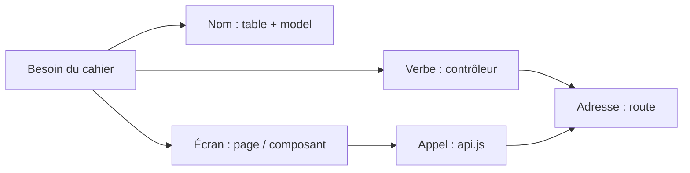

# 7. Pourquoi chaque fichier existe (et comment le nommer)

On ne devine pas les fichiers : on part des besoins du cahier des charges et on applique une méthode fixe. Chaque besoin donne des **données** (une table), des **actions** (un contrôleur), des **adresses** (des routes) et un **écran** (une page ou un composant).

## 7.1 La méthode pour savoir quel fichier créer

1. **Lister les « choses »** du cahier des charges (les noms) : employé, département, pointage, congé, bulletin, évaluation, dossier… Chaque nom devient une **table** dans `db/schema.sql`.
2. **Lister les actions** (les verbes) : pointer, demander un congé, approuver, générer la paie, transmettre un dossier… Chaque groupe d'actions sur une même chose devient un **contrôleur** dans `controllers/`.
3. **Donner une adresse à chaque action** : `POST /api/leaves` = demander un congé. Chaque groupe d'adresses devient un fichier dans `routes/`.
4. **Repérer le code répété** :
   - « vérifier le jeton et le rôle » sert dans presque toutes les routes → `middleware/auth.js` ;
   - « la requête SQL d'un employé avec son département » sert dans plusieurs contrôleurs → `models/Employee.js` ;
   - « calculer des jours ouvrés », « envoyer une notification », « écrire dans l'audit » → `utils/`.
5. **Isoler la configuration** : connexion à la base → `config/`, secrets → `.env`.
6. **Côté client, découper l'écran en morceaux** : chaque page du menu devient un fichier de `pages/` ; chaque morceau réutilisé sur plusieurs pages (fenêtre, badge, carte, pointage) devient un **composant** dans `components/`.
7. **Repérer les données partagées par plusieurs écrans** (utilisateur connecté, thème, messages) → un **contexte** dans `context/`.
8. **Regrouper les appels au serveur** → `services/api.js`.

C'est l'architecture **MVC** (Modèle – Vue – Contrôleur) : le modèle gère les données, le contrôleur applique les règles, la vue (React) affiche.



## 7.2 Exemple complet n° 1 : « l'agent pointe son arrivée » (F14)

| Question | Réponse | Fichier |
| --- | --- | --- |
| Quelle donnée stocker ? | Agent, jour, heure d'arrivée, statut, GPS | Table `attendance` dans `db/schema.sql` |
| Quelle règle ? | Un seul pointage par jour | `UNIQUE (employee_id, work_date)` dans le schéma **et** `ON CONFLICT` dans le contrôleur |
| Quelle action ? | `checkIn` | `controllers/attendanceController.js` |
| Quelle adresse ? | `POST /api/attendance/check-in` | `routes/attendanceRoutes.js`, branché dans `server.js` |
| Qui a le droit ? | Tout agent connecté | `protect` dans `middleware/auth.js` |
| Quelle date « aujourd'hui » ? | Selon le fuseau horaire | `toISODate` dans `utils/dates.js` + `TZ` dans `.env` |
| Quel écran ? | Une carte avec l'heure et un bouton | `components/CheckInCard.jsx`, utilisé dans le tableau de bord et dans `pages/Attendance.jsx` |
| Quel appel ? | `api.post('/attendance/check-in', position)` | `services/api.js` |

## 7.3 Exemple complet n° 2 : « transmettre un dossier au service suivant » (F36)

1. **Données** : le dossier (`projects`), les étapes (`circuit_steps`), la trace (`project_history`).
2. **Requêtes réutilisées** : `PROJECT_SELECT`, `getCircuit`, `nextReference` → `models/Project.js`.
3. **Action** : `projectAction` avec `action = 'advance'` → `controllers/projectController.js`.
4. **Adresse** : `POST /api/projects/:id/actions` → `routes/projectRoutes.js`.
5. **Règles de droits** : `canProcess` (dans le contrôleur, car elles dépendent du dossier lui-même, pas seulement du rôle).
6. **Prévenir le nouvel agent** : `notifyEmployee` → `utils/notify.js`.
7. **Tracer** : `logActivity` → `utils/audit.js`.
8. **Écran** : le bouton « Transmettre » et sa fenêtre → `pages/ProjectDetail.jsx`.

## 7.4 Les conventions de nommage

| Élément | Convention | Exemples | Pourquoi |
| --- | --- | --- | --- |
| Dossiers | minuscules, au pluriel | `controllers`, `routes`, `pages`, `components` | Un dossier contient **plusieurs** fichiers du même genre |
| Contrôleurs | `nomController.js` en *camelCase* | `leaveController.js` | On sait immédiatement ce que contient le fichier |
| Routes | `nomRoutes.js` | `leaveRoutes.js` | Même nom que le contrôleur associé : on les retrouve par paires |
| Modèles | *PascalCase*, au singulier | `Employee.js`, `Project.js` | Un modèle décrit **une** chose |
| Utilitaires | *camelCase*, selon le rôle | `dates.js`, `payroll.js`, `notify.js` | Nom court qui dit ce que ça fait |
| Classe | *PascalCase* | `AppError.js` | Convention JavaScript pour les classes |
| Composants et pages React | *PascalCase*, extension `.jsx` | `CheckInCard.jsx`, `ProjectDetail.jsx` | React **exige** une majuscule pour distinguer un composant d'une balise HTML (`<Modal>` et `<div>`) ; `.jsx` signale qu'il contient du JSX |
| Contextes | `NomContext.jsx` | `AuthContext.jsx` | Le suffixe dit que c'est un contexte |
| Hooks | commencent par `use` | `useFetch.js`, `useAuth()` | Règle de React : un hook commence par `use` |
| Tables SQL | *snake_case*, au pluriel | `performance_reviews`, `project_history` | Convention SQL ; une table contient plusieurs lignes |
| Colonnes SQL | *snake_case* | `employee_id`, `date_of_joining` | PostgreSQL met tout en minuscules : les majuscules ne sont pas pratiques |
| Clés étrangères | `table_au_singulier_id` | `department_id`, `agent_id` | On devine vers quelle table elles pointent |
| Variables d'environnement | *MAJUSCULES_SNAKE* | `DATABASE_URL`, `JWT_SECRET` | Convention universelle |
| Adresses de l'API | `/api/` + nom au pluriel + `/:id` | `/api/leaves/12/review` | Style REST : une ressource, puis une action |
| Documentation | numéro + tirets | `05-base-de-donnees-postgresql.md` | Les fichiers s'affichent dans l'ordre de lecture |

## 7.5 Fichiers à la racine

| Fichier | Pourquoi il existe | Comment savoir qu'il le faut |
| --- | --- | --- |
| `package.json` | Raccourcis pour lancer le serveur et le client depuis la racine (`npm run server`, `npm run client`, `npm run seed`) | Dès qu'on a deux sous-projets et qu'on est fatigué de faire `cd` |
| `.gitignore` | Empêche d'envoyer sur GitHub `node_modules/` (très lourd, se réinstalle avec `npm install`), `dist/` (se reconstruit) et `.env` (**secrets**) | **Toujours**, avant le premier commit |
| `README.md` | La page d'accueil du dépôt sur GitHub : présentation, installation, comptes de démo | Tout projet partagé |
| `docs/` | Ces 7 documents | Pour pouvoir expliquer et refaire le projet |
| `.github/workflows/ci.yml` | Lance les tests et le build sur GitHub à chaque envoi | Dès qu'il y a des tests automatiques |

## 7.6 Fichiers du serveur (`server/`)

| Fichier | Pourquoi il existe |
| --- | --- |
| `package.json` / `package-lock.json` | Liste des dépendances et scripts. `package-lock.json` fige les versions exactes : tout le monde installe la même chose. Il est généré par npm, on ne l'écrit pas à la main |
| `.env` / `.env.example` | Les réglages et secrets (non partagés) et leur modèle (partagé) |
| `server.js` | Le point d'entrée : crée Express, branche les middlewares et les routes, crée les tables, démarre l'écoute. Tout commence ici |
| `config/db.js` | La connexion à PostgreSQL, à un seul endroit. Si on change de base, on ne modifie que ce fichier |
| `db/schema.sql` | La structure de la base (les 16 tables). En SQL pur, car c'est le langage de PostgreSQL ; on peut aussi l'exécuter directement dans pgAdmin |
| `middleware/auth.js` | Vérifier le jeton (`protect`) et le rôle (`authorize`) : utilisé par presque toutes les routes |
| `middleware/errorHandler.js` | Une seule façon de répondre aux erreurs, au lieu de répéter des `try/catch` dans chaque contrôleur |
| `middleware/sanitize.js` | Nettoyer toutes les données reçues avant qu'elles n'arrivent aux contrôleurs |
| `models/Employee.js` | Requêtes sur les employés réutilisées par plusieurs contrôleurs (`findEmployeeById`, `nextEmployeeCode`…) |
| `models/User.js` | Recherche d'un compte par email ou par id |
| `models/Project.js` | Requête complète d'un dossier, circuit applicable, prochaine référence |
| `controllers/authController.js` | Inscription, connexion, profil, mot de passe (F1 à F5) |
| `controllers/employeeController.js` | Fiches employés, recherche, libre-service (F6 à F11) |
| `controllers/departmentController.js` | Départements (F12, F13) |
| `controllers/attendanceController.js` | Pointage, corrections, clôture, rapport mensuel (F14 à F18) |
| `controllers/leaveController.js` | Congés et soldes (F19 à F22) |
| `controllers/payrollController.js` | Génération, liste, PDF et paiement des bulletins (F23 à F26) |
| `controllers/performanceController.js` | Évaluations, objectifs, analyse (F27 à F30) |
| `controllers/projectController.js` | Dossiers : paramétrage, enregistrement, circuit, pièces, récépissé (F31 à F40) |
| `controllers/dashboardController.js` | Les chiffres du tableau de bord (F41) |
| `controllers/reportController.js` | Les rapports (F42) |
| `controllers/notificationController.js` | Notifications, annonces, calendrier (F43, F44) |
| `controllers/userController.js` | Comptes et journal d'audit (F5, F45) |
| `routes/*.js` | Un fichier par contrôleur : les adresses et les droits. `miscRoutes.js` regroupe les petites routes (tableau de bord, notifications, rapports, comptes) pour ne pas créer cinq fichiers de trois lignes |
| `utils/AppError.js` | Lancer une erreur avec un code HTTP en une ligne (`assert`) |
| `utils/dates.js` | Calculs de dates utilisés par les présences, les congés et la paie |
| `utils/payroll.js` | Les **règles de calcul** de la paie, séparées du contrôleur : on peut les tester et les modifier sans toucher au reste |
| `utils/payslipPdf.js` | La mise en page du bulletin PDF, séparée du calcul |
| `utils/notify.js` | Créer des notifications (utilisé par la plupart des contrôleurs) |
| `utils/audit.js` | Écrire dans le journal d'audit (utilisé partout) |
| `utils/sanitize.js` | Petites fonctions : `pick` (garder les champs autorisés), `buildUpdate`, `toInt`, `pagination` |
| `utils/migrate.js` | Exécuter `schema.sql` (appelé par `server.js` et par `seed.js`) |
| `utils/runMigrate.js` | Le petit script de `npm run migrate` |
| `utils/seed.js` | Les données de démonstration |
| `tests/api.test.js` | Les tests automatiques de l'API |

**Pourquoi séparer routes et contrôleurs ?** Le fichier de routes se lit comme un **sommaire** : on voit en 15 lignes toutes les adresses d'un module et qui y a droit. Le contrôleur contient le « comment ».

**Pourquoi `utils/payroll.js` et pas tout dans le contrôleur ?** Le calcul de la paie est une règle métier pure : des chiffres entrent, des chiffres sortent, sans base de données ni HTTP. Isolé, il est facile à relire, à tester et à adapter au barème officiel.

## 7.7 Fichiers du client (`client/`)

| Fichier | Pourquoi il existe |
| --- | --- |
| `package.json` | Dépendances : react, react-dom, react-router-dom, lucide-react ; outils : vite, @vitejs/plugin-react |
| `index.html` | La seule page HTML : React dessine tout dans `<div id="root">` |
| `vite.config.js` | Active React dans Vite, définit le port et le proxy `/api` |
| `vercel.json`, `public/_redirects` | En ligne, redirigent toutes les adresses (`/employees/5`) vers `index.html`, car c'est React qui gère la navigation (sinon, erreur 404 quand on recharge une page) |
| `public/favicon.svg`, `public/manifest.webmanifest` | L'icône de l'onglet et la description pour installer le site comme une application |
| `.env.example` | `VITE_API_URL` pour la mise en ligne |
| `src/index.jsx` | Le point de départ : les fournisseurs de contexte, puis `App` |
| `src/App.jsx` | La carte des adresses du site et leur protection |
| `src/index.css` | Tout le style : couleurs (thème clair et sombre), mise en page, responsive, impression |
| `src/services/api.js` | **Le seul fichier qui parle au serveur**. Si l'adresse du serveur change, on ne modifie que lui |
| `src/context/AuthContext.jsx` | L'utilisateur connecté, disponible partout |
| `src/context/ThemeContext.jsx` | Le mode sombre |
| `src/context/ToastContext.jsx` | Les messages « Enregistré », « Erreur… » |
| `src/utils/format.js` | Formats d'affichage (montants, dates) et libellés en français des valeurs de la base |
| `src/utils/useFetch.js` | Le chargement de données, écrit une fois, utilisé par toutes les pages |
| `src/components/ui.jsx` | Les petites briques d'interface regroupées dans un seul fichier, car chacune fait quelques lignes |
| `src/components/Layout.jsx` | Le cadre commun : menu, barre du haut, cloche, bouton de thème |
| `src/components/CheckInCard.jsx` | Le pointage, utilisé sur deux pages |
| `src/components/EmployeeForm.jsx` | Formulaire employé, utilisé dans la liste **et** dans la fiche |
| `src/components/ProjectForm.jsx` | Formulaire d'enregistrement d'un dossier |
| `src/components/InsightsPanel.jsx` | Analyse de performance, utilisée sur trois pages (fiche employé, Performance, Mon espace) |
| `src/dashboard/*.jsx` | Le tableau de bord, dans son propre dossier comme le demandait la structure du projet, car il a deux versions (Admin/RH et Agent) et un widget |
| `src/pages/*.jsx` | Une page par entrée du menu, plus `Login`, `Register`, `EmployeeDetail` et `ProjectDetail` |

**Page ou composant ?**
- **Page** (`pages/`) : elle a sa propre adresse (`/leaves`) et apparaît dans `App.jsx`.
- **Composant** (`components/`) : un morceau réutilisé, ou trop gros pour rester dans une page.
- Un sous-composant utilisé par **une seule** page reste dans le fichier de cette page (par exemple `ApplyForm` dans `Leaves.jsx`, ou `ActionModal` dans `ProjectDetail.jsx`). On le sort dans `components/` le jour où une deuxième page en a besoin.

## 7.8 Ordre de création conseillé

On crée toujours un fichier **après** ceux dont il dépend (on ne peut pas importer un fichier qui n'existe pas encore).

```mermaid
flowchart TB
  subgraph Serveur
    S1[.gitignore, package.json, .env] --> S2[config/db.js]
    S2 --> S3[db/schema.sql + utils/migrate.js]
    S3 --> S4[server.js avec /api/health]
    S4 --> S5[utils/AppError.js + middleware/errorHandler.js + sanitize.js]
    S5 --> S6[models/User.js + Employee.js]
    S6 --> S7[middleware/auth.js]
    S7 --> S8[authController + authRoutes]
    S8 --> S9[departments, employees]
    S9 --> S10[utils/dates, notify, audit]
    S10 --> S11[attendance, leaves]
    S11 --> S12[utils/payroll + payslipPdf + payroll]
    S12 --> S13[performance]
    S13 --> S14[models/Project + projects]
    S14 --> S15[dashboard, reports, notifications, users]
    S15 --> S16[utils/seed.js + tests]
  end
  subgraph Client
    C1[vite.config.js + index.html] --> C2[services/api.js]
    C2 --> C3[context/Auth, Theme, Toast]
    C3 --> C4[utils/format + useFetch]
    C4 --> C5[components/ui.jsx + index.css]
    C5 --> C6[index.jsx + App.jsx]
    C6 --> C7[Login, Register, Layout]
    C7 --> C8[Dashboard + CheckInCard]
    C8 --> C9[Departments, Employees]
    C9 --> C10[Attendance, Leaves, Payroll]
    C10 --> C11[Performance]
    C11 --> C12[Projects, ProjectDetail, ProjectSettings]
    C12 --> C13[Reports, Announcements, Users, Profile]
  end
  S16 --> C1
```



**Pour chaque nouveau module**, la même routine :
1. Table dans `schema.sql` → redémarrer → vérifier dans pgAdmin.
2. Contrôleur → routes → branchement dans `server.js`.
3. Test dans Thunder Client (document 6).
4. Page React → lien dans `NAV` (`Layout.jsx`) → route dans `App.jsx`.
5. Tester avec les trois profils.
6. `git add .` puis `git commit -m "Module X"`.

## 7.9 Arborescence complète

```
EMS/
├── .github/workflows/ci.yml
├── .gitignore
├── package.json
├── README.md
├── docs/
│   ├── 01-presentation-du-projet.md
│   ├── 02-cahier-des-charges.md
│   ├── 03-guide-realisation.md
│   ├── 04-commandes-et-code-expliques.md
│   ├── 05-base-de-donnees-postgresql.md
│   ├── 06-api-rest.md
│   └── 07-pourquoi-chaque-fichier.md
├── server/
│   ├── .env.example            (+ .env, non versionné)
│   ├── package.json
│   ├── server.js
│   ├── config/db.js
│   ├── db/schema.sql
│   ├── middleware/  auth.js · errorHandler.js · sanitize.js
│   ├── models/      Employee.js · Project.js · User.js
│   ├── controllers/ attendance · auth · dashboard · department · employee · leave ·
│   │                notification · payroll · performance · project · report · user  (…Controller.js)
│   ├── routes/      attendance · auth · department · employee · leave · misc ·
│   │                payroll · performance · project  (…Routes.js)
│   ├── utils/       AppError · audit · dates · migrate · notify · payroll ·
│   │                payslipPdf · runMigrate · sanitize · seed  (.js)
│   └── tests/api.test.js
└── client/
    ├── index.html · vite.config.js · vercel.json · package.json · .env.example
    ├── public/      favicon.svg · manifest.webmanifest · _redirects
    └── src/
        ├── index.jsx · App.jsx · index.css
        ├── services/api.js
        ├── context/    AuthContext · ThemeContext · ToastContext  (.jsx)
        ├── utils/      format.js · useFetch.js
        ├── components/ ui · Layout · CheckInCard · EmployeeForm · ProjectForm · InsightsPanel  (.jsx)
        ├── dashboard/  Dashboard · AdminDashboard · EmployeeDashboard · AnnouncementsWidget  (.jsx)
        └── pages/      Login · Register · Employees · EmployeeDetail · Departments · Attendance ·
                        Leaves · Payroll · Performance · Projects · ProjectDetail · ProjectSettings ·
                        Reports · Announcements · Users · Profile  (.jsx)
```

---
Projet SIGRH (EMS) — documentation.
